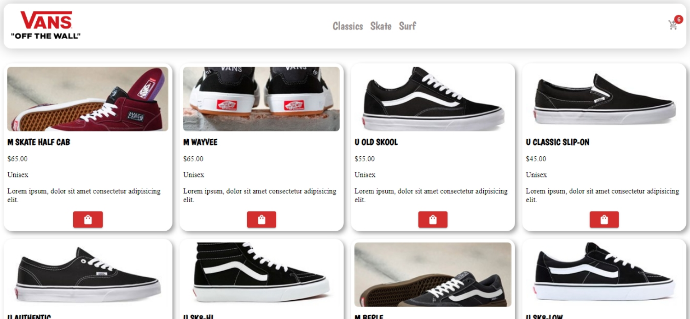
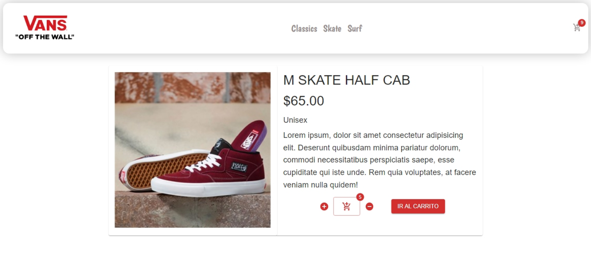
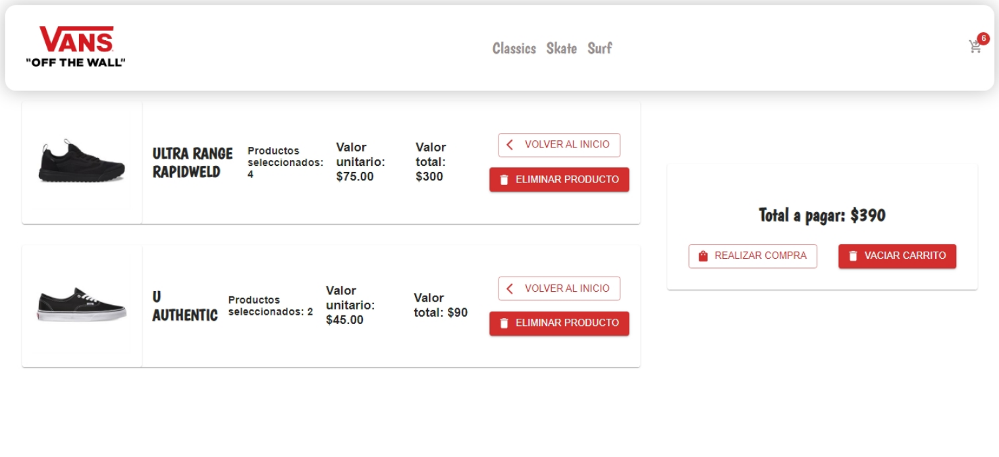

## `ECOMMERCE VANS`

## `Descripción.`
Este proyecto se centra en realizar una replica de la tienda Oficial de Vans, con modificaciones a gusto pero con la misma finalidad, navegar entre sus productos, tener la posibilidad de ver mas detalle sobre el producto que el usuario seleccione y llevar a cabo una compra, todos los pasos desde la pagina.

## `Estado.`
El proyecto se encuentra en estado de finalización.

## `Caracteristicas.`

Este Proyecto esta creado con React, entre las funcionalidades de esta libreria destaco la utilizacion de "Hooks" los cuales nos permiten el manejo de estados, como lo es "useState", alojar contenido de gran tamaño y este ejecutarlo una unica vez, como lo es el caso de "useEffect" así como tambien dando paso al resto del contenido dejando que este se ejecute sin colisionar con el resto, dando una mejor experiencia de usuario.
Tambien, el manejo de rutas evitando recargar la pagina y todo su contenido nuevamente, como lo es "React Router".
Para la estilizacion de la misma usé librerias como Material UI y Styled Components aun que tambien en casos excepcionales
utilicé CSS.

## `Instalación.`

Este proyecto fue creado con la funcionalidad de [Create React App](https://github.com/facebook/create-react-app).

Una vez descargado/clonado este repositorio, para su ejecución es necesario dirigirse a su carpeta desde un editor de codigo y ejecutar el siguiente comando desde terminal:

### npm start.

Este comando correra la aplicacion en modo desarrollador, es decir en un directorio local.
[http://localhost:3000](http://localhost:3000) en tu navegador

## `Demo.`
Si deseas visitar esta pagina puedes hacerlo mediante este enlace: [Project demo](https://ecommerce-vans-joseottonello.vercel.app/)

## `Preview.`

### Dependencias.

Dentro del proyecto se encuentra un archivo llamado "package.json" en el cual se encuentran todas las dependencias que el proyecto necesita. Es importante instalar algunas de ellas ya que no vienen por defecto en el comando de [Create React App](https://github.com/facebook/create-react-app).

### Para mas información.

[Create React App documentation](https://facebook.github.io/create-react-app/docs/getting-started).

[React documentation](https://reactjs.org/).

[NPM](https://www.npmjs.com/).

[React Router](https://reactrouter.com/).

[Material UI](https://mui.com/).

[Styled Components](https://styled-components.com/).

